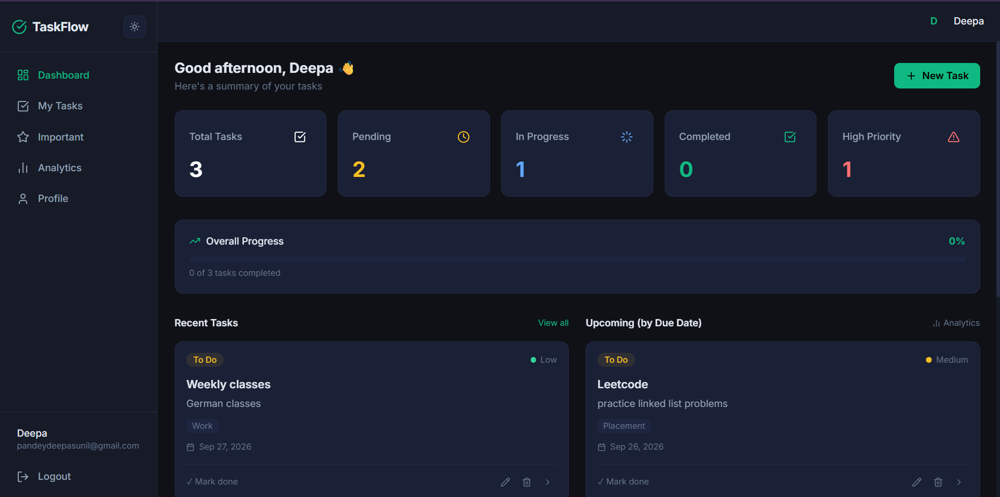
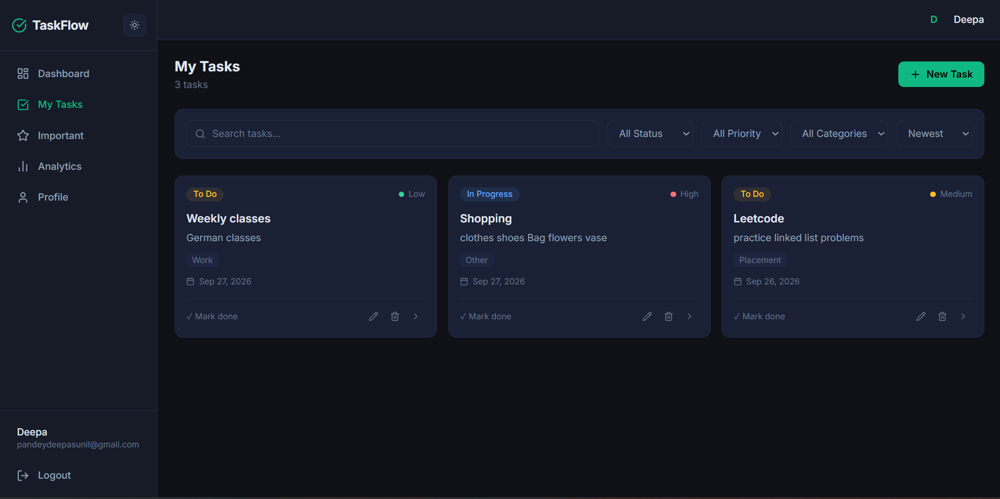
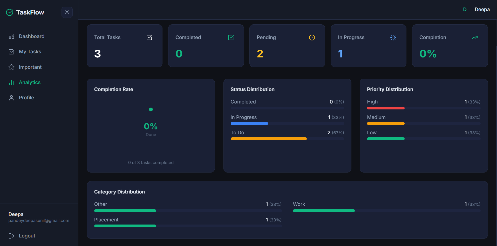

# TaskFlow

A full-stack task management app built with the MERN stack, featuring JWT authentication, user-scoped CRUD, MongoDB aggregation-based analytics, and API rate limiting via Upstash Redis.

## Features

- **Authentication** — register/login with email + password (bcrypt-hashed), JWT-based sessions (7-day expiry)
- **User-scoped task CRUD** — create, read, update, and delete tasks; every query is scoped to the authenticated user via a `userId` field and enforced in the middleware layer
- **Status, priority & category** — tasks can be `TODO` / `IN_PROGRESS` / `COMPLETED`, `LOW` / `MEDIUM` / `HIGH` priority, and categorized (`Personal`, `Work`, `Study`, `Placement`, `Other`), with optional due dates
- **Filtering, search & sorting** — filter by status/priority/category, search by title/description, sort by newest, oldest, or due date
- **Analytics dashboard** — task totals, completion rate, and status/priority/category breakdowns computed with a MongoDB aggregation pipeline (`$facet`)
- **API rate limiting** — all requests are throttled (100 requests / 60s) using Upstash Redis
- **Light/dark theme** — toggle persisted via a React context
- **Responsive layout** — sidebar navigation with a mobile-friendly collapsible menu

## Screenshots

> Screenshots live in [`screenshots/`](./screenshots). Add your own images there (see [`screenshots/PLACEHOLDER.md`](./screenshots/PLACEHOLDER.md) for filenames) — none are included yet.

| Dashboard | Tasks | Analytics |
|---|---|---|
|  |  |  |

## Tech Stack

**Frontend:** React 19, Vite, React Router v6, Tailwind CSS + DaisyUI, Axios, Lucide React, React Hot Toast

**Backend:** Node.js, Express 5, MongoDB + Mongoose, JSON Web Tokens, bcryptjs, Upstash Redis (`@upstash/ratelimit`)

## Architecture

```
┌──────────────┐   HTTPS/JSON, JWT in    ┌──────────────┐        ┌─────────────┐
│  React SPA   │   Authorization header  │  Express API │───────▶│   MongoDB   │
│ (Vite build) │ ──────────────────────▶ │  (Node.js)   │        │ (Mongoose)  │
└──────────────┘ ◀────────────────────── └──────┬───────┘        └─────────────┘
                                                 │
                                                 ▼
                                         ┌───────────────┐
                                         │ Upstash Redis │
                                         │ (rate limiter)│
                                         └───────────────┘
```

The React SPA calls a REST API secured with JWTs. Every task route runs through auth middleware that verifies the token and scopes all reads/writes to `req.userId`. A rate-limiting middleware checks each request against Upstash Redis before it reaches any route handler.

## Project Structure

```
TO-DO/
├── backend/
│   ├── src/
│   │   ├── config/
│   │   │   ├── db.js            # MongoDB connection
│   │   │   └── upstash.js       # Redis rate-limiter client
│   │   ├── controllers/
│   │   │   ├── authControllers.js
│   │   │   └── tasksController.js
│   │   ├── middleware/
│   │   │   ├── authMiddleware.js  # JWT verification
│   │   │   └── rateLimiter.js
│   │   ├── models/
│   │   │   ├── User.js
│   │   │   └── Task.js
│   │   ├── routes/
│   │   │   ├── authRoutes.js
│   │   │   └── tasksRoutes.js
│   │   ├── utils/
│   │   │   └── generateToken.js
│   │   └── server.js
│   └── package.json
├── frontend/
│   ├── src/
│   │   ├── components/         # TaskCard, TaskForm, TaskFilters, StatsCard, ThemeToggle, ProtectedRoute
│   │   ├── context/             # AuthContext, ThemeContext
│   │   ├── layouts/
│   │   │   └── AppLayout.jsx    # Sidebar shell for protected pages
│   │   ├── lib/                 # axios instance, shared utils/constants
│   │   ├── pages/                # Landing, Login, Register, Dashboard, Tasks, TaskDetail, CreateTask, Important, Analytics, Profile
│   │   ├── services/             # authService, taskService (API calls)
│   │   ├── App.jsx
│   │   └── main.jsx
│   └── package.json
├── screenshots/                 # README images (see Screenshots section)
└── package.json                 # Root build/start scripts for deployment
```

## Getting Started

### Prerequisites

- Node.js (v18+)
- A MongoDB instance (local or [MongoDB Atlas](https://www.mongodb.com/atlas))
- An [Upstash](https://upstash.com/) Redis database (free tier works)

### 1. Clone the repository

```bash
git clone https://github.com/Deepa-Pandey6030/TO-DO.git
cd TO-DO
```

### 2. Configure environment variables

Create a `.env` file inside `backend/`:

```env
PORT=5001
NODE_ENV=development
MONGO_URI=your_mongodb_connection_string
JWT_SECRET=your_jwt_secret
UPSTASH_REDIS_REST_URL=your_upstash_redis_url
UPSTASH_REDIS_REST_TOKEN=your_upstash_redis_token
```

### 3. Install dependencies

```bash
cd backend && npm install
cd ../frontend && npm install
```

### 4. Run in development

```bash
# Terminal 1 — backend (http://localhost:5001)
cd backend
npm run dev

# Terminal 2 — frontend (http://localhost:5173)
cd frontend
npm run dev
```

### 5. Build for production

From the project root:

```bash
npm run build   # installs deps and builds the frontend
npm start       # starts the backend, which also serves the built frontend
```

When `NODE_ENV=production`, Express serves the compiled `frontend/dist` and handles client-side routing via a catch-all route, so the app runs as a single Node service.

## API Overview

All `/api/tasks` routes require a `Bearer <token>` header and are scoped to the authenticated user.

### Auth — `/api/auth`

| Method | Endpoint | Description |
|---|---|---|
| POST | `/register` | Create a new account |
| POST | `/login` | Log in and receive a JWT |
| GET | `/me` | Get the current authenticated user *(protected)* |

### Tasks — `/api/tasks`

| Method | Endpoint | Description |
|---|---|---|
| GET | `/` | List tasks (`status`, `priority`, `category`, `search`, `sort` query params) |
| GET | `/stats` | Aggregated task statistics (totals, completion rate, breakdowns) |
| GET | `/:id` | Get a single task |
| POST | `/` | Create a task |
| PUT | `/:id` | Update a task |
| PATCH | `/:id/status` | Update only a task's status |
| DELETE | `/:id` | Delete a task |

## Deployment

The root `package.json` builds the frontend and starts the backend as a single service, which fits platforms like [Render](https://render.com) or Railway: point the build command at `npm run build` and the start command at `npm start`, then set the environment variables listed above.

If deployed on Render's free tier, the service spins down after inactivity, so the first request after a while may take a few seconds to respond while it wakes up.

## License

ISC
